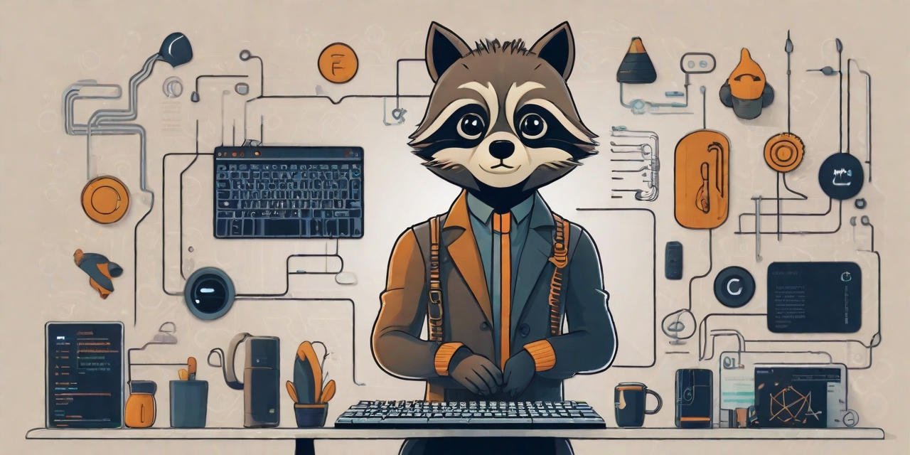

# 🦝 Henga

I'm an aspiring full-stack developer building my version of the digital world one step at a time. All coding projects
are built from the ground up, from planning and designing all the way to solving real-life problems with code. My work 
involves using web technoogy using Typescript/Javascript and golang, machine learning with Python and I am getting
interested in low level programming with C++ and rust.

<!-- TODO: Add badges for my personal website, for the github basic stats (followers and stars) and personal website. -->

   

      
   

--- 
### Languages and Tools

    
    
    
    
    
    
    
    
    
    
    
     

--- 

### 📊 Stats

        

 

--- 

### Coding journey
<!-- TODO: Complete the coding journey -->

 
<h3>👨‍💻 Henga's coding journey</h3>

   I started my coding journey as a naive mathematics student with ... 

--- 

### 📫 Contact :
By email : henrygary@hotmail.com
On [twitter](http://x.com/henga)

<!---
GaryHY/GaryHY is a ✨ special ✨ repository because its `README.md` (this file) appears on your GitHub profile.
You can click the Preview link to take a look at your changes.
--->
